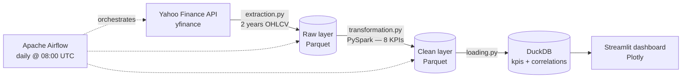
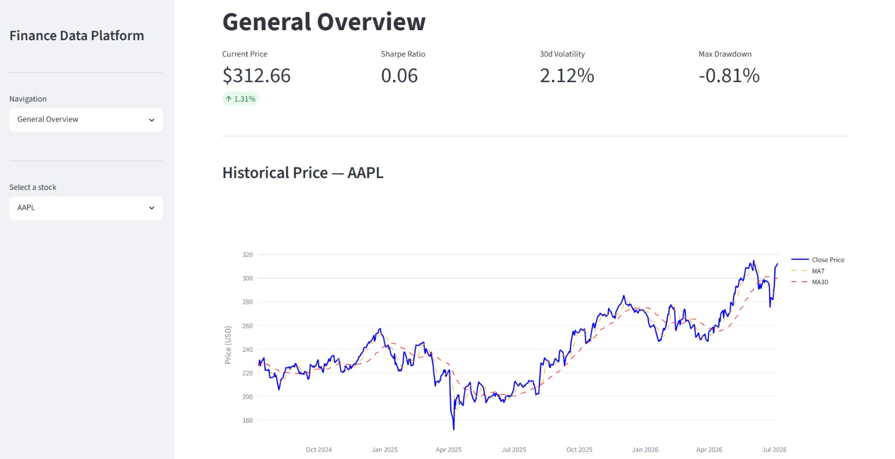
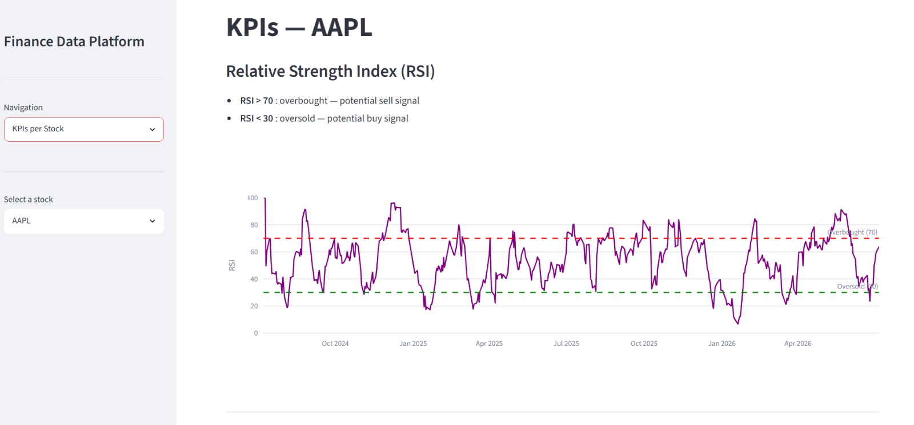
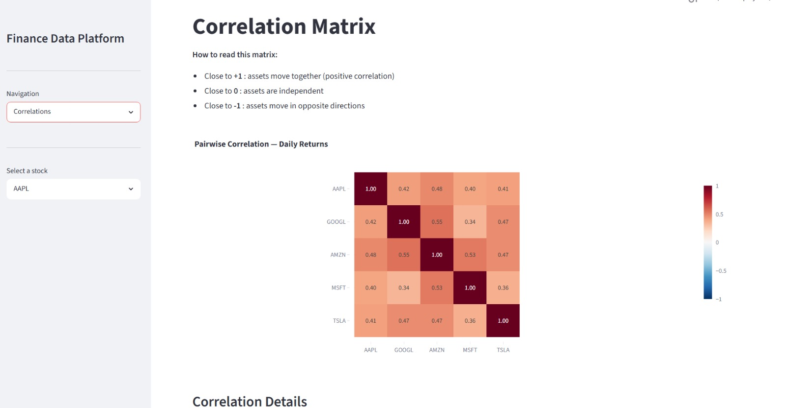

# Finance Data Platform

A production-grade batch ETL pipeline processing daily stock market data
for 5 major tech stocks (AAPL, GOOGL, AMZN, MSFT, TSLA), orchestrated with
Apache Airflow and served through a live Streamlit dashboard.

## Architecture



**Flow:** every day at 08:00 UTC, an Airflow DAG (`finance_batch_pipeline`)
runs three tasks in sequence:

1. **Extract** — pulls 2 years of daily OHLCV data for the 5 tickers from
   the Yahoo Finance API and lands it as Parquet (raw layer)
2. **Transform** — a PySpark job computes 8 financial KPIs per ticker and
   the cross-asset correlation matrix, written back as Parquet (clean layer)
3. **Load** — results are loaded into DuckDB as two analytical tables
   (`kpis`, `correlations`) that power the Streamlit dashboard

## Tech Stack

| Tool | Purpose |
|------|---------|
| Python | Core language |
| PySpark | Large-scale data transformation |
| Apache Airflow | Pipeline orchestration |
| DuckDB | Analytical storage |
| Streamlit | Interactive dashboard |
| Plotly | Data visualization |
| yfinance | Market data extraction |
| Parquet | Columnar storage format |

## Financial KPIs

| KPI | Description |
|-----|-------------|
| Daily Returns | Day-over-day price change (%) |
| Moving Averages | 7-day and 30-day price trends |
| Volatility | 30-day rolling standard deviation |
| Sharpe Ratio | Risk-adjusted return metric |
| Maximum Drawdown | Worst peak-to-trough loss |
| RSI | Relative Strength Index (14-day) |
| Correlation Matrix | Cross-asset correlation analysis |

## Project Structure

```
finance-data-platform/
├── dags/
│   └── batch_pipeline.py      # Airflow DAG — daily ETL orchestration
├── src/
│   ├── extraction.py          # Yahoo Finance API → raw Parquet
│   ├── transformation.py      # PySpark KPI computation → clean Parquet
│   └── loading.py             # Parquet → DuckDB (kpis, correlations)
├── dashboard/
│   └── app.py                 # Streamlit dashboard
├── screenshots/               # Dashboard previews
├── requirements.txt
└── README.md
```

## Getting Started

### Prerequisites

- Python 3.12+
- Java 8+ (required for PySpark)
- Apache Airflow 3.x

### Installation

```bash
# Clone the repository
git clone https://github.com/SalimaYoula/finance-data-platform.git
cd finance-data-platform

# Create virtual environment
python3 -m venv venv
source venv/bin/activate

# Install dependencies
pip install -r requirements.txt
```

### Run the Pipeline Manually

```bash
# Step 1 — Extract
python3 src/extraction.py

# Step 2 — Transform
python3 src/transformation.py

# Step 3 — Load
python3 src/loading.py
```

### Run with Airflow

```bash
export AIRFLOW_HOME=$(pwd)
airflow standalone
```

Open **http://localhost:8080** and trigger `finance_batch_pipeline`.

### Launch Dashboard

```bash
streamlit run dashboard/app.py
```

Open **http://localhost:8501** in your browser.

## Dashboard Preview

### General Overview


### KPIs per Stock


### Correlation Matrix


## Author

Salematou Youla — Data Engineer
[LinkedIn](https://www.linkedin.com/in/salematou-youla) | [GitHub](https://github.com/SalimaYoula)
